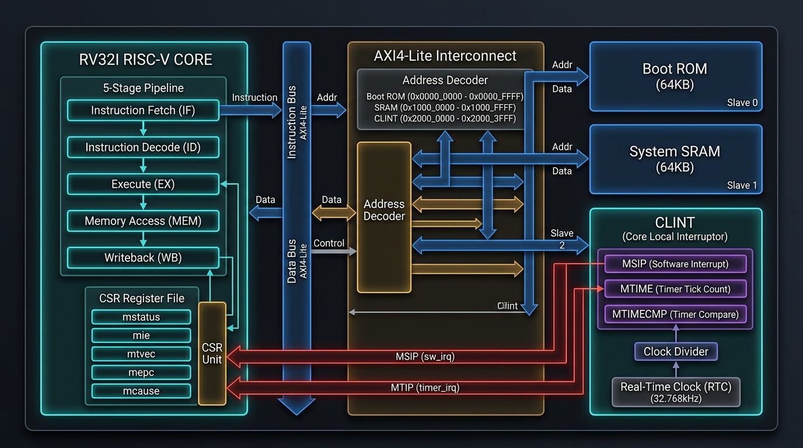

# RISC-V 32-bit Pipelined SoC & CLINT (tsc_work)

A 5-stage pipelined RISC-V processor and System-on-Chip (SoC) implementation in SystemVerilog, developed and simulated using AMD Xilinx Vivado.



---

## 🚀 Key Features

- **RISC-V 32-bit Core**:
  - **5-Stage Classic Pipeline**: IF (Instruction Fetch), ID (Instruction Decode), EX (Execute), MEM (Memory Access), WB (Write Back).
  - **Hazard & Forwarding Unit**: Handles data hazards (RAW) via data forwarding and load-use hazard stalls; handles control hazards via branch prediction / pipeline flushes.
  - **CSR Register File**: Control and Status Registers implementing machine-mode trap handling, interrupt control, and cycle counters (`mstatus`, `mie`, `mip`, `mtvec`, `mepc`, `mcause`, `mtime`, `mtimecmp`, etc.).
- **Core-Local Interruptor (CLINT)**:
  - Standard SiFive / RISC-V compliant memory-mapped CLINT interface.
  - 64-bit real-time counter (`mtime`) and 64-bit timer comparator (`mtimecmp`) for timer interrupts (**MTIP**).
  - Software interrupt generation register (`msip`) for software interrupts (**MSIP**).
- **Bus & Interconnect Subsystems**:
  - **APB (Advanced Peripheral Bus)** subsystem: APB Master, APB Bridge, APB Slave, and APB GPIO/Timer peripherals.
  - **AXI4-Lite Subsystem**: AXI4-Lite Master, Interconnect, ROM, SRAM, and LSU Bridge.
- **Memory Subsystem**:
  - Dedicated Instruction Memory / ROM.
  - Byte-addressable Data Memory / SRAM with write-enable byte masks.
  - Memory-mapped I/O routing for CLINT, APB peripherals, and memories.

---

## 📁 Repository Structure

```
tsc_work/
├── README.md                                    # Project documentation
├── .gitignore                                   # Vivado-specific ignore rules
├── tsc_work1.xpr                                # Vivado Project File
├── riscv_soc_clint_diagram_1786919431883.jpg    # SoC Architecture Diagram
└── tsc_work1.srcs/
    ├── sources_1/new/                           # Design Sources (SystemVerilog / Verilog)
    │   ├── soc_top.v                            # Top-level SoC integration
    │   ├── pipline_top.sv                       # Top-level 5-stage RISC-V core pipeline
    │   ├── IF.sv                                # Instruction Fetch stage
    │   ├── decode_stage.sv                      # Instruction Decode stage & Register File
    │   ├── execute_stage.sv                     # ALU, branch unit & execution stage
    │   ├── data_mem_stage.sv                    # Data memory interface stage & LSU
    │   ├── write_back_stage.sv                  # Write-back stage
    │   ├── hazard_unit.sv                       # Hazard detection and forwarding unit
    │   ├── CSR_Register_File.sv                 # Machine-mode CSR register file
    │   ├── clint.sv                             # Core-Local Interruptor (CLINT)
    │   ├── memory_interface.sv                  # Address decoder and memory controller
    │   ├── data_memory.sv                       # Data RAM / SRAM
    │   ├── inst_memory.sv                       # Instruction ROM / RAM
    │   ├── apb_top.v                            # APB Subsystem Top
    │   ├── apb_bridge.sv                        # APB Bridge module
    │   ├── apb_gpio.sv                          # APB GPIO peripheral
    │   ├── axi4lite_bus_top.sv                  # AXI4-Lite bus top wrapper
    │   ├── axi4lite_interconnect.sv             # AXI4-Lite crossbar/interconnect
    │   ├── axi4_lite_master.sv                  # AXI4-Lite master interface
    │   ├── axi_lsu_bridge.sv                    # AXI-LSU conversion bridge
    │   └── ...                                  # Supporting decoders, ALUs, MUXes
    └── sim_1/new/                               # Verification Testbenches
        ├── soc_top_tb.sv                        # Full SoC simulation testbench
        ├── soc_clint_tb.sv                      # CLINT & timer interrupt testbench
        └── tsc_work_tb.sv                       # Core pipeline simulation testbench
```

---

## 🗺️ CLINT Memory Map (Relative to `CLINT_BASE`)

| Offset | Register Name | Width | Description |
|---|---|---|---|
| `0x0000` | `MSIP` | 32-bit | Machine Software Interrupt Pending (Bit 0) |
| `0x4000` | `MTIMECMP_LO` | 32-bit | Lower 32 bits of 64-bit Timer Compare |
| `0x4004` | `MTIMECMP_HI` | 32-bit | Upper 32 bits of 64-bit Timer Compare |
| `0xBFF8` | `MTIME_LO` | 32-bit | Lower 32 bits of 64-bit Real-Time Counter |
| `0xBFFC` | `MTIME_HI` | 32-bit | Upper 32 bits of 64-bit Real-Time Counter |

---

## 🛠️ Simulation & Build Instructions

### Using AMD Xilinx Vivado:
1. Open **Vivado** (2020.1 or later).
2. Open the project by clicking **Open Project** and selecting `tsc_work1.xpr`.
3. In the **Sources** pane, right-click the desired testbench (e.g. `soc_top_tb.sv` or `soc_clint_tb.sv`) and select **Set as Top**.
4. Click **Run Simulation** &rarr; **Run Behavioral Simulation**.
5. Check waveform outputs for pipeline execution, register writes, memory accesses, and CLINT interrupts.

---

## 👤 Author & Maintainer

- **Owner**: **Shivendra Sahu**
- **GitHub**: [@shivendraMRE39](https://github.com/shivendraMRE39)
- **Repository**: [https://github.com/shivendraMRE39/tsc_work](https://github.com/shivendraMRE39/tsc_work)
- **Email**: [shivendrasahu2004@gmail.com](mailto:shivendrasahu2004@gmail.com)

---

## 📜 License
This project is open-source for educational and research purposes.

